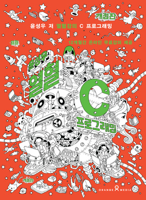
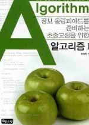
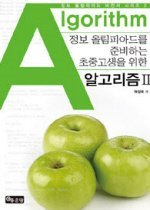

# books :books:

## 목차 
[1. 읽은 책 :closed_book:](##읽은-책-📕)

[2. 읽고 있는 중인 책 :open_book:](##읽고-있는-중인-책-📖)

[3. 읽고 싶은 책 :green_book:](##읽고-싶은-책-📗)

## 읽은 책 :closed_book:

### 고등학교 시절

#### - 윤성우의 열혈 C 프로그래밍

가장 처음으로 접한 Computer Science 책이다.
처음으로 C 언어를 공부하면서 읽었고, 초보자에게 맞는 설명과 예시가 있다고 생각한다. 일부 내용에 대해서 틀린 내용이 있다는 말도 있지만, 초보자가 공부하기에는 좋다고 생각한다.

#### - 정보올림피아드를 준비하는 초중고생을 위한 알고리즘 Ⅰ,Ⅱ

codeup이라는 사이트와 열혈 C 프로그래밍 책으로 C언어에 대해서 공부한 뒤, 블로그나 구글링을 하면서 알고리즘 공부를 하다가 한계를 느끼고 사게 된 책이다. 책이 나온지 꽤 되어서 틀린 내용이나, 교정되지 않는 내용이 있고, 다양한 내용을 다룬다고는 할 수 없지만 이 책에 있는 내용만 해도 되게 다양한 알고리즘을 배울 수 있었다.(물론, 아직도 이 책은 계속 들고 다니면서 들여다보고 있다.)

## 대학교 시절(현재 진행형)

## 읽고 있는 중인 책 :open_book:

## 읽고 싶은 책 :green_book:
